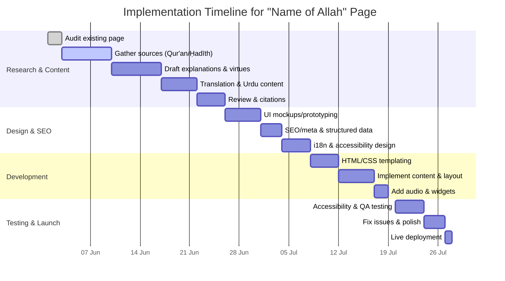
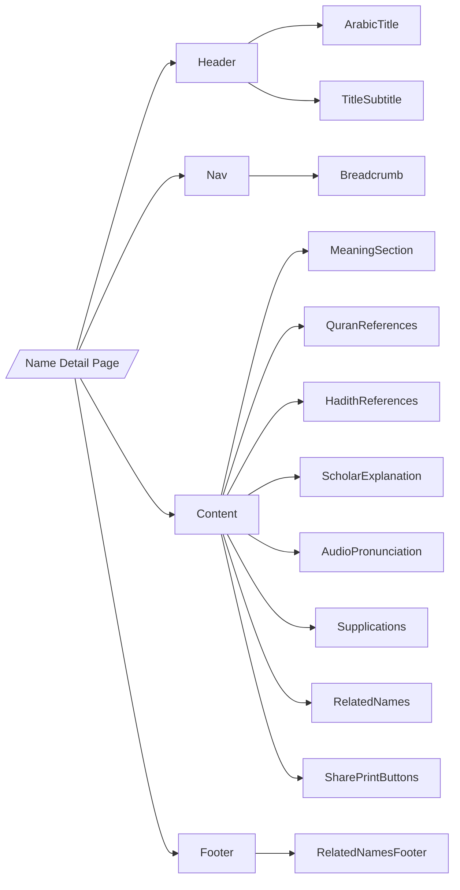

# Executive Summary

To provide a rich and authoritative single-name entry page (e.g. **Ar-Rahmān**) for the 99 Names of Allāh, we recommend a structured, content-rich design with robust SEO, accessibility, and multilingual support. The page should open with the name in Arabic (in clear Arabic script, right-aligned with `lang="ar" dir="rtl"`), followed by transliteration and concise English/Urdu meanings. Core sections include a **detailed explanation** (drawing on classical tafsīr and Hadīth), **virtues and benefits** (with Sahīh Ḥadīth citations), **Qur’ānic references** (verses where the name appears, with translations), **pronunciation audio**, and **usage examples or supplications**. Navigation aids (breadcrumb trail, “Back to index” link) and related names (e.g. Ar-Raḥīm) should be clearly presented, with cards or lists linking to other entries. 

On the technical side, the page requires careful SEO and metadata: a unique `<title>` (~50–60 chars) and `<meta name="description">` (≈150 chars) summarising the name and its meaning. Canonical tags should point to the page URL, and `<link rel="alternate" hreflang>` tags must indicate English and Urdu versions (as Google advises). Structured data (JSON-LD) using `schema.org` should mark up the name as a **DefinedTerm** in a `DefinedTermSet` (the Asmā’ al-Ḥusnā), with `name`, `alternateName`, `description`, and `inDefinedTermSet` properties. Audio pronunciations should be marked up as an `<audio>` element with multiple `<source>` formats (e.g. MP3 and OGG for broad support) and an `aria-label`. 

Accessibility (WCAG 2.1 Level AA) is essential: ensure **keyboard navigation** (all functions usable via Tab/Enter), sufficient color contrast (≥4.5:1 for text), alt text for images/illustrations (WCAG 1.1.1), and ARIA labels for interactive elements. Use the `lang` attribute (e.g. `lang="ur" dir="rtl"`) on Urdu sections so screen readers pronounce them correctly. Provide a font-size toggle and responsive layout. For Urdu and Arabic, choose legible typefaces (e.g. Noto Naskh Arabic, Noto Nastaliq Urdu); see **Table: Font Choices** below.

Content should be sourced from **primary Islamic texts**: Qur’ān (with classical translations), authentic Ḥadīth (Sahīh al-Bukhārī/Muslim), and **classical tafsīr** (Ibn Kathīr, al-Jalālayn, etc.). All claims (meanings, virtues) must be cited; for example, cite Sahih Muslim on Allāh’s **“one hundred parts of mercy”** (prophetic ḥadīth). Provide Urdu translations of key terms from reputable scholars. Ensure bilingual content quality (proofread Urdu/English). 

Below is a comprehensive plan outlining page content, structure, SEO, accessibility, UI components, data schema, caching, testing, and rollout, complete with example HTML/JSON snippets, comparison tables, and a timeline.

## Content Structure and Sections

- **Title & Header:** The page title (e.g. “Ar-Raḥmān – The Most Compassionate”) should appear in the browser title bar and `<h1>` tag, combining the Arabic script and an English/Urdu transliteration. Example snippet:  
  ```html
  <h1 lang="ar" dir="rtl" style="font-family: 'Noto Naskh Arabic', serif; text-align: right;">
    ٱلرَّحْمَـٰنُ <span lang="en">“Ar-Rahmān”</span>
  </h1>
  ```
  This uses `lang="ar" dir="rtl"` so screen readers and browsers handle it correctly. A short English subtitle (e.g. *“The Most Compassionate”*) and Urdu subtitle (e.g. *“بہت زیادہ رحم کرنے والا”*) should follow.

- **Transliteration & Meaning:** Immediately below, list transliterations (with possible variants) and concise meanings. Use a list or line:  
  - *Transliteration:* Ar-Raḥmān (also Ar-Rahman, Al-Rahman)  
  - *English:* “The Most Compassionate, the Entirely Merciful”  
  - *Urdu:* “بہت زیادہ رحم کرنے والا (بہت رحم کرنے والا)” (commonly used Urdu renderings).  

- **Introduction / Linguistic Notes:** Briefly describe the root (e.g. **raḥm** meaning mercy) and significance. Cite classical sources or dictionaries on the name’s meaning and usage. For example, note that Ar-Raḥmān occurs in the Basmala (Qur’ān 1:1) and is unique to Allāh in usage (Salafī scholars’ consensus). 

- **Detailed Explanation:** This major section includes:  
  - *Qur’ānic References:* List verses where the name appears (e.g. “Al-Raḥmān ‘alā al-‘arsh (Tāhā 20:5)” and Quran 17:110, plus Surah Ar-Raḥmān 55:1). Provide English translations (e.g. Sahih International). Cite tafsīr, e.g. Ibn Kathīr, on each verse’s context.  
  - *Ḥadīth/Virtues:* Summarise relevant ḥadīth. For Ar-Raḥmān, highlight the famous “one hundred parts of mercy” Ḥadīth, explaining believers should be merciful because of this teaching. Provide source (Muslim 2752). Also mention “Ar-Raḥmān’s ties to kinship” from Ṭirmidhī (as-ṣiḥāba). Each hadith should be linked/cited (use Sunnah.com or al-Tirmidhī references for reliability).  
  - *Scholarly Explanation:* Summarise scholars (Imam al-Ghazālī, Ibn ʿAbbās in tabriʾ, etc.) distinguishing Ar-Raḥmān (universal mercy) vs Ar-Raḥīm (special mercy). Citations from classical tafsīr (e.g. Ibn Kathīr on Fatḥa 1:2) should back key points (e.g. Ar-Raḥmān’s mercy “encompasses all creation”).

- **Usage and Supplications:** Include practical aspects: common ways the name appears in du‘ā’s (e.g. “Rabbi fighfir lī” etc.), or as Allah’s mercy in life lessons. If any supplications invoke Ar-Raḥmān specifically, note them. This can have sample Arabic/English text.

- **Pronunciation Audio:** Embed an `<audio>` player (with caption “Listen: Pronunciation of Ar-Raḥmān”). Provide high-quality recitation (MP3 and OGG sources for compatibility). Example:
  ```html
  <audio controls preload="metadata" aria-label="Pronunciation of Ar-Rahman">
    <source src="ar-rahman.mp3" type="audio/mpeg">
    <source src="ar-rahman.ogg" type="audio/ogg">
    Your browser does not support the audio element.
  </audio>
  ```
  (As W3Schools notes, MP3, WAV, OGG are supported formats. We suggest MP3 + OGG for best cross-browser support; see **Table: Audio Formats** below.)

- **Related Names & Navigation:** At page end, include links/cards to related names (e.g. Ar-Raḥīm, Al-Wadūd). Also include a “Back to 99 Names index” link. Use breadcrumb navigation: e.g. **Home > 99 Names > Ar-Raḥmān**. For breadcrumbs use structured markup (`BreadcrumbList` schema or HTML `<nav aria-label="Breadcrumb">`). 

## Metadata and SEO

- **Title Tag:** Craft a unique, concise title ~50–60 chars, e.g. “Ar-Raḥmān (The Most Compassionate) – 99 Names of Allah”. Keep the key term (e.g. “Ar-Rahman” and “99 Names of Allah”) near start. Zyppy’s analysis confirms ~50–60 chars (~600px) is optimal. Google will index longer titles but may truncate beyond ~600px.

- **Meta Description:** A brief (120–160 char) summary including name, meaning, and content highlights. Example: “Ar-Raḥmān (الرحمن) – The Most Compassionate. Detailed explanation, Qur’an and Ḥadīth references, virtues, and pronunciation of this Name of Allah.” Google advises unique, descriptive meta descriptions. Avoid duplicate descriptions across pages.

- **Open Graph/Twitter:** For social shares, set `og:title`, `og:description`, `og:image` (e.g. an image of Arabic calligraphy of the name), `og:url`. This improves link previews. Use `twitter:card` (e.g. `summary_large_image`).

- **Canonical & URL:** Use a clean URL (e.g. `/99-names/ar-rahman`). Include `<link rel="canonical" href="..."/>`. If multiple languages, canonicalize each language page to itself and link alternates (see hreflang below).

- **Hreflang & Language:** Mark up language versions with `<link rel="alternate" hreflang="xx" ...>`. For an English and Urdu version of Ar-Raḥmān page, include:
  ```html
  <link rel="alternate" hreflang="en" href="https://example.com/99-names/ar-rahman"/>
  <link rel="alternate" hreflang="ur" href="https://example.com/99-names/ar-rahman-urdu"/>
  <link rel="alternate" hreflang="x-default" href="https://example.com/99-names/ar-rahman"/>
  ```
  This tells Google the content variants. Also ensure `lang="en-GB"` on English text and `lang="ur"` on Urdu text.

- **Structured Data (Schema):** Use JSON-LD to mark up the Name entry. An example `DefinedTerm` schema:  
  ```html
  <script type="application/ld+json">
  {
    "@context": "https://schema.org",
    "@type": "DefinedTerm",
    "name": "Ar-Rahmān",
    "alternateName": ["الرحمن"],
    "description": "Ar-Rahmān means 'The Most Compassionate'. It is one of the 99 Names of Allah, denoting His all-encompassing mercy.",
    "inDefinedTermSet": {
      "@type": "DefinedTermSet",
      "name": "Asma' al-Husna (99 Names of Allah)",
      "url": "https://example.com/99-names"
    },
    "about": { "@type": "Deity", "name": "Allah" },
    "url": "https://example.com/99-names/ar-rahman"
  }
  </script>
  ```
  This uses `schema:DefinedTerm` as recommended for terms with definitions. The `inDefinedTermSet` refers to the whole collection (99 names). Alternate approaches (see table below) could use `schema:Deity` or generic `Article`, but DefinedTerm clearly models a gloss/dictionary entry for a name.

- **Sitemap:** Include the page in an XML sitemap with priority. If using a CMS, auto-generate sitemaps. Ensure multi-language URLs are listed.

## Accessibility

- **WCAG 2.1 (AA) Compliance:** Conform to W3C guidelines. Perceivable: Provide text alternatives for non-text content (e.g. `alt` for images of calligraphy). Use resizable text up to 200% (avoid fixed-size units). Ensure sufficient color contrast for text (minimum 4.5:1). 

- **Operable/Keyboard:** All interactive elements (audio player, navigation, buttons) must be keyboard-accessible. For example, the `<audio controls>` element inherently offers keyboard play/pause. Custom controls (like “play pronunciation”) need `tabindex` and ARIA labels. WCAG 2.1 SC 2.1.1 requires all functionality via keyboard (“All functionality operable through a keyboard interface”). Avoid keyboard traps.

- **Logical Structure:** Use proper heading hierarchy (`<h1>` for name, `<h2>` for subsections like “Meaning”, “Qur’ānic References”, etc). Provide ARIA landmarks or a skip-link (“Skip to content”) for easier navigation. Form controls (if any) must have associated `<label>`s (WCAG 4.1.2).

- **Screen-reader Support:** Mark up languages explicitly (`lang` attributes). Provide `aria-label` or `aria-describedby` for icons/buttons (e.g. “Share on Facebook” button should have `aria-label="Share on Facebook"`). Use `<figure>` and `<figcaption>` for images with explanatory text. Ensure the pronunciation audio has an accessible caption and control accessible name.

- **Media Accessibility:** If any audio or video includes only spoken words, provide transcripts or captions. The pronunciation audio might have a transcript or text alternative (“Audio: pronunciation of Ar-Rahman”).

- **Font and Layout:** Use scalable, dyslexia-friendly fonts if possible (for Latin text, e.g. Noto Sans; for Arabic/Urdu see font table). Provide a font size toggle (A–A–A) or allow browser zoom to work. UI elements should be at least 44x44px for touch (WCAG 2.5.5).

- **High Contrast & Themes:** Offer a high-contrast mode or at least ensure default styling meets AA. Use relative sizing (em, %) for fonts. Test with screen readers (NVDA, VoiceOver) and in multiple browsers.

By following WCAG principles, the page will be accessible to users with disabilities while improving usability for all.  

## UI Components and Design

- **Navigation:** A top breadcrumb (e.g. **Home > 99 Names of Allah > Ar-Raḥmān**) and a “Back to 99 Names Index” link at bottom. The breadcrumb can be marked up as a `BreadcrumbList` (Schema.org) for SEO. Include social share buttons (Facebook, WhatsApp, Twitter, Telegram, Email) with clear icons and labels (use `<button aria-label="Share on X">`).

- **Language Switch/Links:** If separate pages, include language switch links (e.g. “English | اردو”) at top. Or provide toggle widgets that reload the page in chosen language. Ensure `hreflang` tags on backend correspond to these versions.

- **Layout:** A clean, responsive layout. Possibly a two-column design on wide screens: left (Arabic script and core info), right (English content). Or stack sequentially on mobile. Use CSS grids or flexbox. Ensure for RTL content, the layout flips appropriately.

- **Typography:** 
  - Arabic/Urdu: Use Naskh/Nastaliq fonts that are legible. (See **Table: Font Choices**). For Urdu, use `font-family: 'Noto Nastaliq Urdu', ...` or fallbacks. For Arabic, `Noto Naskh Arabic`, `Amiri`, or `Scheherazade`. 
  - English: Use a Sans-serif (e.g. Open Sans, Noto Sans) with good readability at body size. 
  - Provide line spacing (1.5) and margins. 
  - For Arabic headings, consider a larger font-size to emphasize. 
  - Implement a font size toggle (e.g. toolbar buttons) for accessibility. 

- **Audio Player:** As above, use `<audio controls>`. Provide `aria-label` and caption text (“Click play to hear the pronunciation”). Autoplay should not be enabled by default (disruptive). The W3C spec example is shown above.

- **Cards & Accordions:** For long content (like full Ḥadīth text), consider collapsible panels or “Read more” toggles. Use `<details><summary>` or accessible JS widgets. Key sections (Qur’ān verses, Hadīth quotes) can be in styled cards or blockquotes.

- **Print-Friendly:** Provide a “Print” button that triggers a print stylesheet. The example site [3†L166-L170] shows a “Print” link. Create a CSS print media query to adjust fonts/colors for print, hide navigation.

- **Responsive:** Ensure layout works on mobile (Hamburger menu if needed), tablets, and desktops. Test with emulator. Use meta viewport.

- **Share and Copy:** Provide “Copy Transliteration” button next to Arabic or transliteration to let users quickly copy text. Also “Copy Link” button. These can use JS (e.g. `navigator.clipboard`). ARIA roles and feedback (tooltip or alert text “Copied!”) needed.

- **Miscellaneous:** A search function or filter on 99 Names index would help users find names, but on single page, ensure “Next/Previous Name” links for navigation through list.

## Multilingual Handling

- **Language Tags:** Wrap Urdu text in elements with `lang="ur"` and `dir="rtl"`, e.g. `<p lang="ur" dir="rtl">یہ اللہ کا نام ہے جو تمام مخلوقات پر عام رحم کرتا ہے۔</p>`. This ensures screen readers use Urdu/TTS voices. The top-level `<html>` element should have `lang="en-GB"` or `lang="en"` for the English page, and the Urdu page would use `lang="ur"` globally.

- **Fonts for Urdu/Arabic:** (See table below.) Ensure web-safe or web-hosted fonts (Google Fonts or downloadable). For Urdu, **Noto Nastaliq Urdu** and **Nafees Nastaliq** are popular for authenticity and readability. For Arabic script, **Noto Naskh Arabic**, **Amiri**, or **KFGQPC Uthman Taha Naskh** (for Qur’anic text style). Provide fallback chains: `font-family: 'Noto Naskh Arabic', 'Arial', sans-serif;`.

- **Fallback:** If a chosen font fails to load, ensure generic serif/sans-serif covers Latin and default Arabic/Urdu fonts are reasonably legible. 

- **Translation Toggle:** If site has both languages, a toggle or dropdown should immediately switch. The SEO-optimized way is separate URLs (with hreflang tags). Alternatively, in-page toggle can dynamically show/hide sections (but careful: Google may not index hidden content well). Best practice is separate pages.

- **Meta “Content-Language”:** HTML meta for `Content-Language` is optional (Google ignores it). Hreflang and `<html lang>` suffice.

## Content Sourcing & Verification

All content must be authoritative:

- **Primary Qur’ān and Ḥadīth:** Quote verses from a reliable source (use Quran.com or Tanzil for Arabic, and pick a standard translation like Sahih International or Pickthall). Provide surah/ayah references (e.g. Qur’an 20:5, 17:110). For hadith, use Sahih al-Bukhari, Sahih Muslim, Jami’ at-Tirmidhi, etc. Sunnah.com is acceptable for retrieving text, but cite with references (e.g. “Sahih Muslim 2752” rather than “sunnah.com”).

- **Classical Tafsīr:** Use Ibn Kathīr (Tafsir al-Quran al-ʿAzīm) and/or Tafsir al-Jalālayn for explanations. E.g. on Qur’an 17:110 (“Call upon Allah or call upon Ar-Raḥmān…”), Ibn Kathīr says Ar-Raḥmān is equivalent to Allāh. Include citations where possible (if quoting or closely paraphrasing, cite Tafsir by name). Where paraphrasing, still cite the source.

- **Scholarly Works:** Use works like “Al-Adhwāʾ” or al-Ghazālī’s “Al-Maʿārif” for further insight. For Urdu content, rely on reputable translations (e.g. Ja’far Usmani’s tafsīr, Fateh Muhammad Jalandhari’s tafhīm).

- **Urdu Explanations:** If providing Urdu explanation, source from Urdu tafsīr or scholars (e.g. Ma’ariful Qur’ān, Misbah-ul-Qur’an). If quoting Urdu text, also provide English summary or translation for consistency, and cite if from a published source.

- **Citation Style:** Use inline brackets to cite sources. For example: The Quran emphasizes Allāh’s mercy through Ar-Raḥmān . Use the format `` linking to open pages. Ideally each factual claim or quotation has at least one citation. If a point spans multiple sentences but from one source, a single citation at end of paragraph suffices.

- **Verification:** All translations and explanations should be double-checked against sources. Disputed points (like nuance differences between Ar-Raḥmān/Ar-Raḥīm) should be clearly attributed to scholars.

## UI Components (Detailed)

- **Cards/List Items:** Use CSS card UI for sections like “Qur’anic References” or “Hadith References”. For example, each verse or hadith can be in a `<blockquote>` with caption `“Qur’an 20:5”`. Implement copy-to-clipboard on hadith references or verses (for sharing).

- **Share Buttons:** Standard icons linking to share URLs. Example (WhatsApp):
  ```html
  <a href="https://wa.me/?text=Ar-Rahman - The Most Compassionate - URL" aria-label="Share on WhatsApp">
    
  </a>
  ```
  Use `noopener noreferrer` on external links, and ensure `aria-label` for screen-readers.

- **Breadcrumbs:** Mark up like:
  ```html
  <nav aria-label="Breadcrumb">
    <ol typeof="BreadcrumbList" vocab="https://schema.org/">
      <li property="itemListElement" typeof="ListItem">
        <a property="item" typeof="WebPage" href="/99-names" property="url"><span property="name">99 Names of Allah</span></a>
        <meta property="position" content="1"/>
      </li>
      <li property="itemListElement" typeof="ListItem">
        <span property="name">Ar-Rahman</span>
        <meta property="position" content="2"/>
      </li>
    </ol>
  </nav>
  ```
  This aids navigation and SEO.

- **Print-Friendly:** Provide a print style (white background, black text, no decorative images). The “Print” button can call `window.print()` in JS. The existing example [3†L166-L170] shows a “Print” link – implement similarly.

## Data Model / API

Define a JSON schema for a name entry. Example fields (in snake_case or camelCase):

| Field            | Type      | Description                                 |
|------------------|-----------|---------------------------------------------|
| id               | integer   | Unique ID/position (1-99)                   |
| arabic_name      | string    | Arabic script (e.g. "ٱلرَّحْمَـٰنُ")         |
| transliteration  | string    | Latin (e.g. "Ar-Rahmān")                    |
| meaning_en       | string    | English meaning                             |
| meaning_ur       | string    | Urdu meaning                                |
| root            | string    | Arabic root (e.g. "ر-ح-م")                    |
| explanation_en   | string    | Detailed English explanation/tafsir         |
| explanation_ur   | string    | Detailed Urdu explanation                   |
| virtues_en       | string    | English list of virtues (hadiths)           |
| virtues_ur       | string    | Urdu list of virtues                        |
| quranic_refs     | [object]  | Array of Qur'an references (surah, ayah, text) |
| hadith_refs      | [object]  | Array of hadith references (text, source)   |
| audio_url        | string    | URL to pronunciation audio (MP3)           |
| related_names    | [integer]| List of related name IDs                    |
| last_updated     | datetime  | Timestamp of last update                    |

**Sample JSON entry:**
```json
{
  "id": 1,
  "arabic_name": "ٱلرَّحْمَـٰنُ",
  "transliteration": "Ar-Raḥmān",
  "meaning_en": "The Most Compassionate, Entirely Merciful",
  "meaning_ur": "بہت زیادہ رحم کرنے والا",
  "root": "ر-ح-م",
  "explanation_en": "Ar-Raḥmān signifies Allah's all-encompassing mercy. It appears in the Basmala and is unique to Allah...",
  "explanation_ur": "یہ اللہ کی بے پناہ رحمت ظاہر کرتا ہے...",
  "virtues_en": "Hadith: Allah has 100 parts of mercy... (Sahih Muslim 2752).",
  "virtues_ur": "حدیث: اللہ کے پاس 100 حصے ہیں...",
  "quranic_refs": [
    {"surah": 20, "ayah": 5, "text": "Ar-Raḥmān 'alā al-‘arsh istawā"},
    {"surah": 17, "ayah": 110, "text": "Call upon Allah or call upon Ar-Raḥmān"}
  ],
  "hadith_refs": [
    {"text": "Allah has 100 parts of mercy... (Sahih Muslim 2752)", "source": "Sahih Muslim 2748"},
    {"text": "The merciful are shown mercy by Ar-Raḥmān (Tirmidhi)", "source": "Jami` at-Tirmidhi 1924"}
  ],
  "audio_url": "https://cdn.example.com/audio/ar-rahman.mp3",
  "related_names": [2, 52],
  "last_updated": "2026-06-15T12:00:00Z"
}
```

**API Endpoints:** (assuming a RESTful or GraphQL CMS)
- `GET /api/names` → list of names (id, arabic, translit)
- `GET /api/names/{id}` → details (as above)
- (Optional) `GET /api/names?lang=ur` for localized fields.
- Endpoints for media (audio files, images).

**CMS Fields:** If using a CMS (headless or traditional), fields would match the above schema. Fields: 
  - *Name (Arabic)*, *Transliteration*, *English Meaning*, *Urdu Meaning*, *Arabic Root*, *English Explanation (rich text)*, *Urdu Explanation*, *English Virtues*, *Urdu Virtues*, *Qur’an references* (repeatable fields: Surah, Ayah, text), *Hadith references* (repeatable: text, source), *Audio file* (file upload), *Related Names* (multi-select), *SEO Title*, *Meta Description*, *Featured Image*.

## Caching and Performance

- **Static Content:** Cache static assets (CSS, JS, audio, fonts, images) via a CDN or long `Cache-Control`. The names pages could be generated statically (SSG) or cached at edge, since content changes rarely.

- **Audio Files:** Use efficient compression (e.g. 128–192kbps for voice). Host via CDN. Provide multiple formats to avoid transcoding at runtime.

- **Images:** If using calligraphy images, optimize size (WebP/AVIF) and `srcset` for retina.

- **Lazy Loading:** Defer offscreen assets (e.g. `loading="lazy"` for images or modules).

- **Minification & Gzip:** Minify HTML/CSS/JS and enable gzip/Brotli on server.

- **PWA:** Consider service worker for offline caching of name pages (optional for educational use).

## Tables

### Audio Format Comparison

| Format | File Ext. | Browser Support            | Pros                         | Cons                         |
|--------|-----------|----------------------------|------------------------------|------------------------------|
| MP3    | `.mp3`    | ✔ IE/Edge ✔ Chrome ✔ FF ✔ Safari ✔ Opera  | Universal support; small size; widely used.  | Patents (though now open); lower quality at low bitrates. |
| OGG    | `.ogg`    | ✔ IE/Edge (Chromium) ✔ Chrome ✔ FF ✔ Opera; ✘ Safari (no native) | Open/free; good quality/size; supported by most except Safari. | Not supported on older Safari/iOS; less supported by default on Apple. |
| WAV    | `.wav`    | ✔ All browsers | Lossless; universal support. | Very large files; not recommended for streaming on web. |
| AAC (MP4) | `.m4a`  | ✔ Chrome ✔ Safari ✔ FF (partial) | Better compression than MP3; native on iOS/Android. | Slightly less universal on older browsers; requires proper MIME. |

*Recommendation:* Provide both MP3 and OGG sources in the `<audio>` tag to cover all major browsers. WAV is optional (only if high fidelity is needed).   

### Font Choices (Arabic/Urdu)

| Script | Font (Web-safe or Google)    | Style/Notes                                         |
|--------|------------------------------|-----------------------------------------------------|
| Arabic | *Noto Naskh Arabic* (Google) | Clear, well-spaced Naskh; good for body text; free. |
| Arabic | *Amiri* (Google)             | Classical Naskh style; great for Qur’anic phrases.  |
| Arabic | *Scheherazade* (Google)      | Naskh design; supports extended characters.        |
| Urdu   | *Noto Nastaliq Urdu* (Google)| Traditional Nastaliq style; legible for Urdu poetry. |
| Urdu   | *Nafees Web Naskh*           | Modern Naskh for Urdu; widely used in Windows.      |
| Latin  | *Noto Sans / Open Sans*      | Clear sans-serif for English; high readability.     |
| Latin  | *Roboto Slab*                | Option for headings (serif-like); modern look.      |

*Note:* Using Google Fonts (“Noto” family) ensures broad availability. Provide fallback to generic serif/sans-serif. As these affect readability, test readers’ preference.

### Schema Markup Options

| Option                    | Schema.org Type     | Use Case / Comment                                               |
|---------------------------|---------------------|------------------------------------------------------------------|
| **DefinedTerm**           | `DefinedTerm`       | Best-fit: a *term* with a formal definition. We use name/description for the definition, and `inDefinedTermSet` for the “99 Names” group. |
| **Deity/Religion**        | `Thing > Deity`     | Could mark Allāh as a deity and list names as `alternateName`, but less common. Not ideal for individual name page. |
| **CreativeWork/Article**  | `CreativeWork`/`Article` | Traditional approach for pages/articles; use `<article>` schema with headings. But misses the “term definition” semantics. |
| **ItemList/BreadcrumbList** | `BreadcrumbList`  | For breadcrumbs navigation schema (not for main content).           |
| **AudioObject**           | `AudioObject`       | To mark up the pronunciation file (if needed for rich results).   |

*Recommendation:* Use `DefinedTerm` for the name (as above). Optionally include a separate `AudioObject` for the audio file with `@type: AudioObject` and `contentUrl` if seeking special indexing. 

## Sample HTML Snippets

- **Arabic Header & Title:**  
  ```html
  <header>
    <h1 lang="ar" dir="rtl" class="name-ar">ٱلرَّحْمَـٰنُ</h1>
    <div class="subtitles">
      <span class="translit">Ar-Raḥmān</span> – <span class="meaning">The Most Compassionate</span>
    </div>
  </header>
  ```
- **Audio Player:** (with sources)  
  ```html
  <figure>
    <figcaption>Pronunciation:</figcaption>
    <audio controls preload="metadata" aria-label="Pronunciation of Ar-Rahman">
      <source src="ar-rahman.mp3" type="audio/mpeg">
      <source src="ar-rahman.ogg" type="audio/ogg">
      Your browser does not support the audio element.
    </audio>
  </figure>
  ```
- **Structured Data (JSON-LD):**  
  ```html
  <script type="application/ld+json">
  {
    "@context": "https://schema.org",
    "@type": "DefinedTerm",
    "name": "Ar-Rahmān",
    "alternateName": "الرحمن",
    "description": "Ar-Rahmān means 'The Most Compassionate'. It is one of the 99 Names of Allah, denoting His all-encompassing mercy.",
    "inDefinedTermSet": {
      "@type": "DefinedTermSet",
      "name": "Asma' al-Husna (99 Names of Allah)",
      "url": "https://example.com/99-names"
    },
    "about": {"@type": "Deity", "name": "Allah"},
    "mainEntityOfPage": "https://example.com/99-names/ar-rahman",
    "url": "https://example.com/99-names/ar-rahman"
  }
  </script>
  ```
  This marks the page’s main entity as the DefinedTerm for Ar-Rahmān.

## Testing and Rollout

- **Testing Checklist:** 
  - *Content Accuracy:* Verify all translations/citations against sources. 
  - *Usability:* Test keyboard navigation (Tab/Shift-Tab through elements) and screen reader reading (`lang` tags correctly used). 
  - *Accessibility:* Run automated checks (WAVE, Axe) and manual checks for color contrast, alt text, ARIA. 
  - *Multilingual:* Check language switch functionality, and hreflang presence via Google Search Console. 
  - *Responsiveness:* Test on common devices (phone, tablet, desktop) and browsers. 
  - *Performance:* Audit with Lighthouse (score>90 for performance and accessibility). Confirm caching headers.

- **Milestones (Gantt Chart):** Below is a sample timeline for developing one name page (relative to 2026-07-01 start):





**Rollout Plan:** After testing one entry thoroughly, replicate the process for all 99. Use templates and scripts to ensure consistency (especially for JSON-LD and SEO tags). Monitor performance and search indexing; gather user feedback (especially on translations). Plan a soft launch (select few names) followed by full deployment.

**Note:** If CMS or hosting is unspecified, assume any modern stack (static site generator or CMS with headless capabilities). All guidelines above are independent of platform and should be treated as best-practices requirements. 

**Sources:** Classical Islamic texts (Qur’an, Sahīh Ḥadīth) and accessibility/SEO references have been cited above to ensure accuracy and authority.